# :hospital: E-HEALTHCARE-MANAGEMENT-WITHOUT-DATABASE-
  * Project completed within a week.
  * Console Based Project using JAVA and eclipse as the environment.
## Functionalities
  * The project contains two model classes : admin and Doctor
  * Admin can assign doctor for the patient.
  * Admin can insert and  delete doctor and patient details.
  * Doctor can give prescribed medicene to the patient.
  * Doctor can serach the patient using patient id.
  * All the data is stored in excel.
## Screenshots
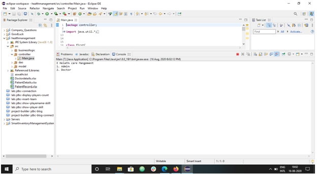 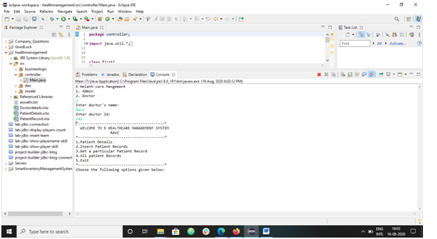 
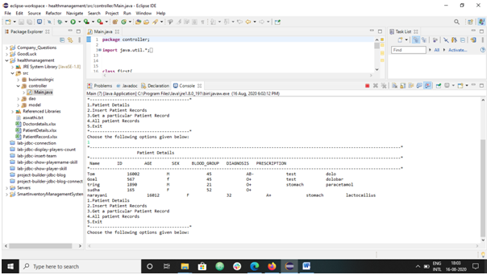 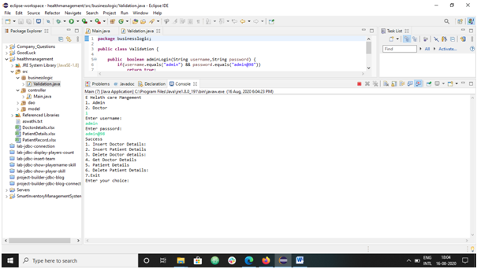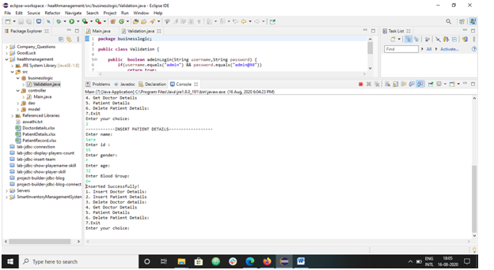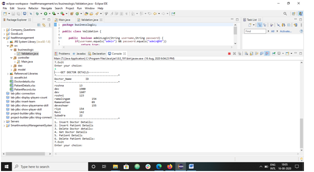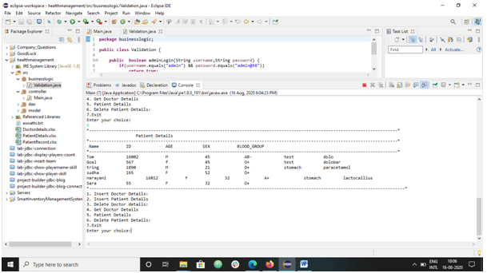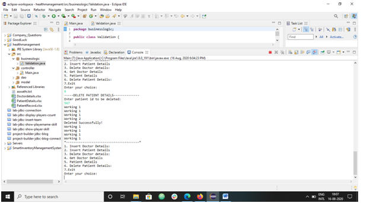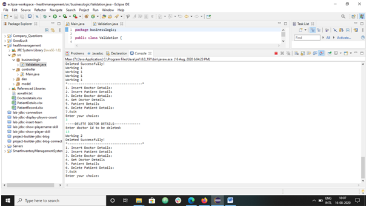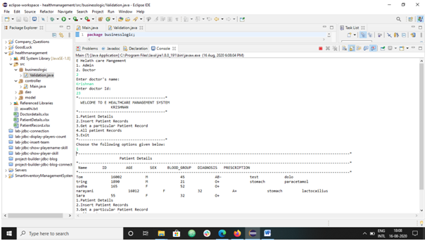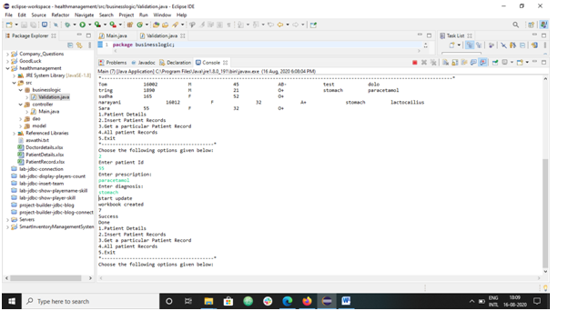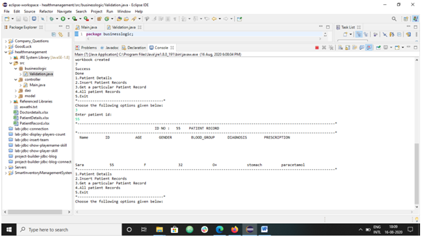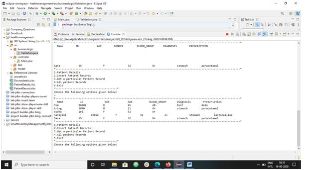

